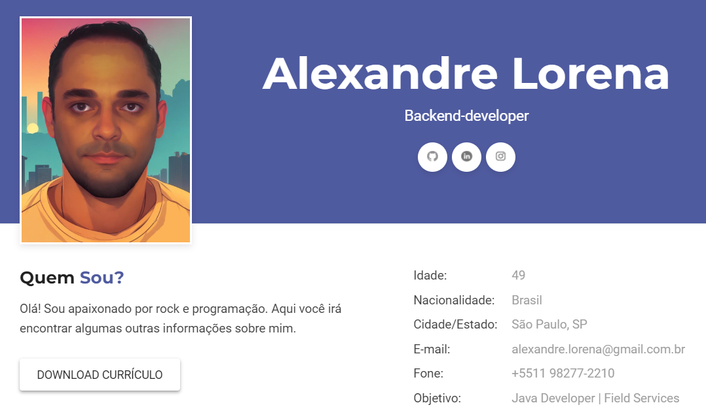

# Resume

### [Click here](https://alexandrelorena.github.io/index.html) or in the image to access my online resume.

  

 

 

<!--  -->

<!-- SOCIAL_LINKS_START -->

  &nbsp;&nbsp;
  <!------------------------------------------->
    &nbsp;&nbsp;
  <!------------------------------------------->
  &nbsp;&nbsp;
  <!------------------------------------------->
  &nbsp;&nbsp;
  <!------------------------------------------->
  &nbsp;&nbsp;
  <!------------------------------------------->
  &nbsp;&nbsp;
  <!------------------------------------------->
  

<!-- SOCIAL_LINKS_END -->
